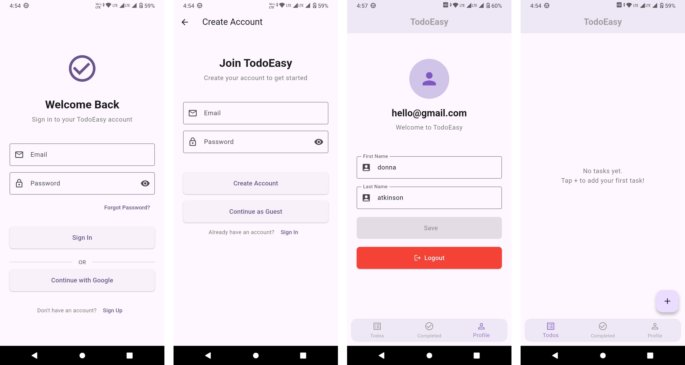
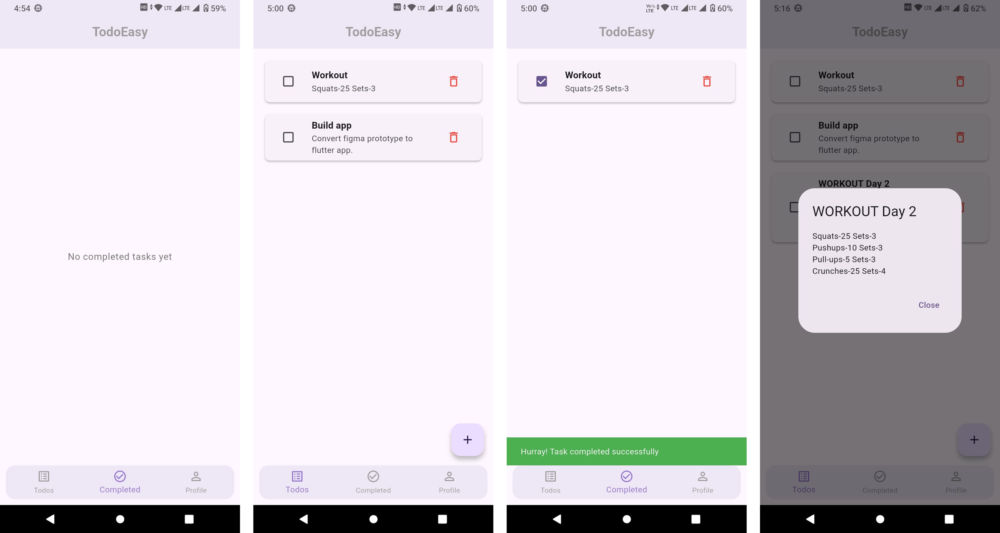

# 📝 New Todo - Ultimate Productivity Companion

**Flutter** | **Dart** | **Android** | **iOS**

> **New Todo** is a modern and sleek mobile application engineered to help you organize your life with efficiency and style. Built with Flutter, this project leverages the power of Firebase to deliver real-time synchronization and a seamless user experience.

Stay on top of your tasks, manage your schedule, and enjoy a fluid, intuitive interface designed for modern mobile standards.

---

## ✨ Features

Experience a robust feature set crafted for performance and usability:

- **🔐 Secure Authentication**
  - Seamless Google Sign-In integration.
  - Robust session management via Firebase Auth.
  
- **☁️ Real-time Cloud Sync**
  - Instant data synchronization across all your devices using Cloud Firestore.
  - Offline support so you never lose a thought.

- **🔔 Smart Notifications**
  - Stay updated with timely push notifications powered by Firebase Cloud Messaging (FCM).
  - Customizable alerts to ensure you never miss a deadline.

- **🎨 Modern UI/UX**
  - Clean, distraction-free interface built with Material 3 design principles.
  - Smooth animations and responsive layout.

- **📂 Efficient Task Management**
  - Create, edit, and delete tasks with a single tap.
  - Organize tasks with intuitive categorization.

## 📸 Screenshots

<div align="center">
  
  <br/><br/>
  
</div>

## 🛠️ Tech Stack & Architecture

This project is built on a solid foundation of modern mobile development practices, ensuring scalability and maintainability.

### Core Framework
- **[Flutter](https://flutter.dev/)**: UI Toolkit for building natively compiled applications.
- **[Dart](https://dart.dev/)**: The language powering the app.

### Architecture Highlights
The codebase is organized to separate concerns effectively:

- **`presentation/`**: Contains all UI logic, Screens (Home, Authentication, Dashboard), and Widgets.
- **`models/`**: Pure data classes defining the shape of domain entities (`UserDetails`, `TaskDetails`).
- **`util/`**: Helper functions and utilities.
- **`widgets/`**: Reusable UI components for consistent design.

### Key Libraries

- **Backend & Services**:
  - `firebase_core`, `firebase_auth`, `cloud_firestore`: For backend infrastructure.
  - `firebase_messaging`: For push notifications.
- **Utilities**:
  - `google_sign_in`: For authentication flows.
  - `permission_handler`: For managing system permissions.
  - `uuid`: For generating unique identifiers.

## 📂 Project Structure

A glimpse into the organized file structure of the project:

```
lib/
├── models/             # Data models (UserDetails, TaskDetails)
├── presentation/       # UI Layer organized by Feature
│   ├── authentication/ # Login and Auth screens
│   ├── home/           # Dashboard and Main screens
│   └── ...
├── widgets/            # Reusable components
├── util/               # Constants and helper methods
├── firebase_options.dart
└── main.dart           # Application Entry Point
```

## 🚀 Getting Started

Follow these steps to set up the project locally.

### Prerequisites
- **Flutter SDK**: [Install Flutter](https://docs.flutter.dev/get-started/install)
- **Firebase Project**: Set up a project in the [Firebase Console](https://console.firebase.google.com/) and download `google-services.json` (for Android) and `GoogleService-Info.plist` (for iOS).

### Installation

1. **Clone the repository**
   ```bash
   git clone https://github.com/milanrnw/todo_app.git
   cd new_todo_app
   ```

2. **Install Dependencies**
   ```bash
   flutter pub get
   ```

3. **Configure Firebase**
   - Place `google-services.json` in `android/app/`.
   - Place `GoogleService-Info.plist` in `ios/Runner/`.

4. **Run the Application**
   Connect a physical device or start an emulator.
   ```bash
   flutter run
   ```